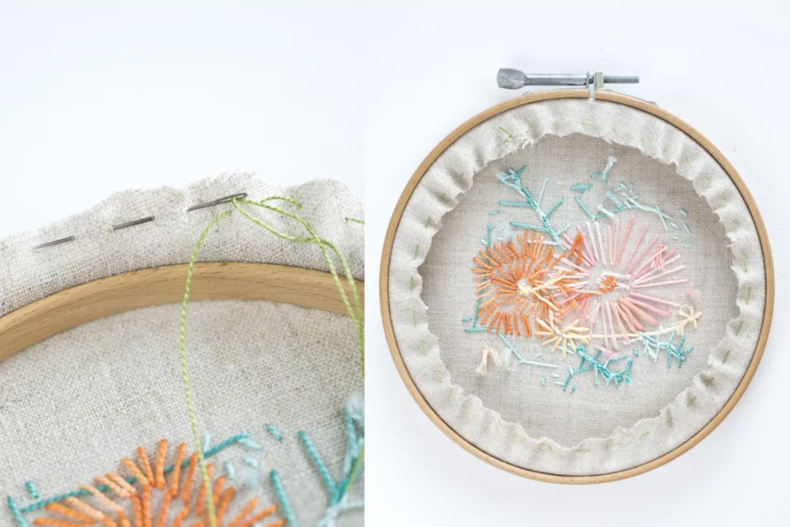

# Stitching basics

There are _a lot_ of embroidery stitches to choose from and a ton of resources on the internet to peruse. I am not attempting to recreate any of those amazing resources, but I compiled some here that could be useful as you learn to stitch.

I am not a professional or career stitcher, but I have learned which stitches and hacks work best for me. Other stitches and techniques may be your favorites! Use my suggestions as a guide and base from which to explore and learn what works best for you.

## Knot and thread your needle

Your stitching design is prepped and ready, so now it's time to get your needle and floss ready to rock.

Unravel a piece of floss (any number of strands is good---I usually do between 3 and 6 strands) that is roughly the length of your arm from your wrist to your elbow. Working with floss that is too long makes it easier to get the backside of your fabric knotted up, messy, and tangled.

Before threading your floss through your needle, tie a double knot at one end.

> Double knot demo from [Instructables.com](https://www.instructables.com/lesson/Threading-Needles-and-Knotting-Thread/)

When I started stitching, I really struggled to get the damn embroidery floss through my embroidery needle eye---And I'm not the only one! It's tricky business, but there is a hack that you will thank (nay, PRAISE) me for later.

Enter the... pinch and press method!

To thread the non-knotted end of your embroidery floss through your needle:

1. Loop the end of thread over the sharper/smaller end of the needle.
1. Just underneath the needle, pinch the loop tightly between your thumb and forefinger.
1. Remove the needle from the loop, pinching to allow only a teeny tiny portion of the loop to poke up above your pinched fingers.
1. Turn the needle around and carefully place your teeny tiny loop through the eye of the needle. If you've pinched it small enough, it should slide right in.
1. Pull the loop through, leaving a tail of several inches.

   > Pinch and press needle threading method example

   

If all else fails, lick the end of your floss and try to poke it through the eye. I promise you the above method is easier and faster, though.

## Common stitches

It's time to dive right into stitching. I've listed some of my favorite and most-used stitches below, but do some Googling---The wild world of embroidery stitches is vast.

### Backstitch

This is my [most-used stitch](https://sublimestitching.com/pages/how-to-back-stitch). It produces clean outlines and straight lines and I just find it pleasing to look at and to stitch.

> [Backstitch by Jenny Hart](https://sublimestitching.com/pages/how-to-back-stitch) of Sublime Stitching

### Reverse chain stitch

The [reverse chain stitch](https://sublimestitching.com/pages/how-to-chain-stitch) saved my chain stitch life. I could not, for the life of me, get the regular chain stitch to work easily and look right. When I finally did some internet research and tried the reverse chain, I breathed a sigh of relief.

> [Reverse chain stitch by Jenny Hart](https://sublimestitching.com/pages/how-to-chain-stitch) of Sublime Stitching

### Stem stitch

This one is [pretty](https://sublimestitching.com/pages/how-to-stem-stitch). It's great for outlines, vines and leafy stuff, or anything you want to look clean but have some texture.

> [Stem stitch by Jenny Hart](https://sublimestitching.com/pages/how-to-stem-stitch) of Sublime Stitching

### Split stitch

This one is a good ole standby as well. You have to be using an even number of floss strands though, as when you come up through your fabric you split the strands evenly. This provides a nice texture and is satisfying to stitch.

> [Split stitch by Jenny Hart](https://sublimestitching.com/pages/how-to-split-stitch) of Sublime Stitching

### French knot

Some people love it, and some people hate it. I happen to _love_ the french knot. It can be painful to master (it's all about that tension), but once you do, it will be your funky, bumpy friend. I love to fill a space with french knots, scatter them about artistically, or accentuate my designs.

> [French knot by Jenny Hart](https://sublimestitching.com/pages/how-to-french-knot) of Sublime Stitching

### Seed stitch

Fun! Simple! Cute! [Seed stitch](https://createwhimsy.com/projects/embroidery-seed-stitch/) is your easy-to-hang-with friend. Fill a space, putter around your embroidery fabric space, or add some texture with this stitch. It's even more fun if you use multiple colors to achieve a confetti-type look.

> [Seed stitch by Create Whimsy](https://createwhimsy.com/projects/embroidery-seed-stitch/)

### Satin stitch

[Satin stitch](https://sublimestitching.com/pages/how-to-satin-stitch) is a very standard stitch. I love the way it looks and fills spaces. But for whatever reason, I have the hardest time making it look precise. It's an often used stitch by embroiderers!

> [Satin stitch by Jenny Hart](https://sublimestitching.com/pages/how-to-satin-stitch) of Sublime Stitching

## Fix mistakes

Some embroidery mistakes are worth fixing, and some aren't. If the thread becomes knotted and tangled on the front or back, you can unthread the floss from your needle and pick out each stitch by hand until you get it untangled.

Often though, the tangles are too thick and unruly to untangle. Get out those small fine-pointed scissors! Sometimes its best to just cut the whole shebang out and start over.

Carefully snip stitches on the front and/or back until you can remove your floss from the fabric safely. Then rethread your needle and start over!

Sewing Bird also has some [great tips about fixing common embroidery mistakes](https://www.sewingbird.net/pages/how-to-clean-up-the-back-and-fix-common-embroidery-mistakes).

## Finish your embroidery

There are so many ways to finish your embroidery, and through some trial and error you'll find your favorite way to finish it---and hopefully come up with exciting new ideas along the way!

Some ways to finish off your embroidery include:

*  Displaying it in a hoop hung on the wall or leaning on a bookshelf
*  Mounting it on a framed canvas and hanging it on the wall
*  Using it as fabric to make other things, like pillowcases or aprons
*  Cutting it out and placing it in a necklace pendant
*  Cutting it out and adhering it to a card or cardboard to send to a friend or loved one

I typically mount mine in a hoop for hanging on the wall (and sometimes I stain or paint my embroidery hoop first, and let it dry, before mounting my fabric again).

To finish your embroidery in the hoop:

1. If you want to stain or paint your hoop, remove your embroidery before you begin. Ensure the paint or stain is completely dry (I recommend letting it dry overnight) before putting your fabric back in.

   Leaving it as the raw wood is a great look, and the most common approach I take.

   **Note**: Since after mounting you only see the front side, you only need to stain or paint the top ring (the one with the tightening mechanism).

1. [Mount the fabric in your hoop](/prepare-project#mount-your-fabric) like you did when you prepared your fabric to begin stitching. Center the design you stitched in the hoop as you tighten the outer ring (or not---wonky off-centered is cool too).
1. Ensure the fabric is pulled taut in the hoop and the front side of the hoop looks as you desire.
1. Tighten the screw at the top (make sure the screw is at the top for easy hanging!) until the entire thing feels secure.
1. Trim the fabric around your hoop, leaving about 1/2" of fabric hanging out.
1. Run an embroidery floss around the edges of your fabric ([running stitch](https://www.thesprucecrafts.com/working-the-running-stitch-1177571)), about 1/8" from the cut edge.
1. Cut your floss, leaving a couple inches of tail, and pull it taut. The fabric should cinch up nicely on the back side.
1. Knot the two ends of the floss running around your hoop.

   > Cut, stitch, and cinch your fabric to finish by [The Spruce](https://www.thesprucecrafts.com/finishing-the-back-of-hooped-embroidery-4115406)

   

I like the leave the back side of my stitching exposed, because I think it looks cool. But if I'm feeling fancy, I will trace my hoop ring on a piece of felt, cut out the circle, and hot glue it or [whip stitch](https://www.womansweekly.com/craft/how-to-do-whip-stitch-15167/) around the back edges of my hoop. This makes a solid colored flat back to your embroidery.

> Felt and whip stitch finishing

### Tie off stitching

